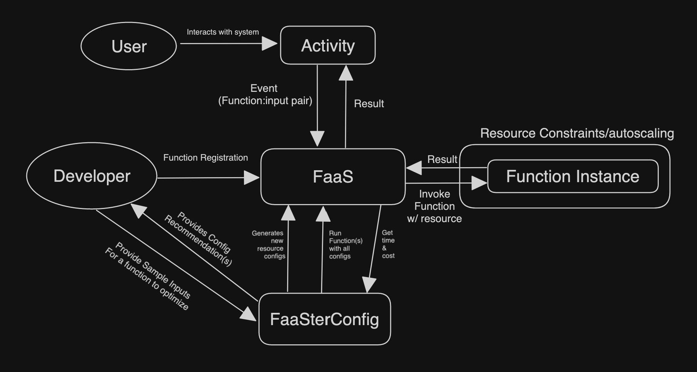

# FaaSterConfig
Automatic resource configuration generator for FaaS functions. Goal is to provide a way for a developer to automatically find the best (lowest time & cheapest cost) configurations for their function with various inputs. 



This repo contains jupyter notebooks, openFaas functions, and script(s) to generate configs and interact with OpenFaas to determine which config is the best for a given function 

## Setup 

Lots of methods here will make use of various libraries, its good to just install everything from the requirements.txt file (optionally create a pyenv first)
```bash
pip install -r requirements.txt
```
### Notebooks

Start testing things with existing or create new jupyter notebooks and store them in the notebooks directory

### OpenFaaS

If you want to test out some of the functions by themselves, install faas-cli and use it to upload/run the functions in the openFaas directory

on mac: 

```bash
brew install faas-cli
cd openFaas
faas-cli local-run greeter
```

in a new terminal, send a curl request locally: 

```bash
curl http://0.0.0.0:8080 -X POST  --data 'ECHO'
```
This should return Echo to the terminal 

### FaaSterConfig

This python script will generate a set of configurations, save them in a _gen.yml file, then call the `faas-cli local-run` command to test that function locally. Future plans involve running this in an openFaas cluster and expanding what nodeTypes are available

```bash
cd FaaSterConfig
python3 FaaSterConfig.py ../openFaas/matmul.yml -c 1 6 12 -nt NoGPU -d 5000
```

This on in particular will run the matmul function on 1 6 and 12 cpus (default memory configs, check `python3 FaaSterConfig.py --help` for more options), on only one node type (no gpu since its local) and will send the function an input of "5000"

The output will look like this: 

```txt
Generated 9 configurations, testing now
duration of matmul_CPU6.0_Mem_16384.0_NoGPU: 4.616424s
duration of matmul_CPU6.0_Mem_248.0_NoGPU: 4.061081s
duration of matmul_CPU6.0_Mem_1024.0_NoGPU: 4.169447s
duration of matmul_CPU1.0_Mem_1024.0_NoGPU: 26.475706s
duration of matmul_CPU1.0_Mem_16384.0_NoGPU: 26.474107s
duration of matmul_CPU1.0_Mem_248.0_NoGPU: 26.074201s
duration of matmul_CPU12.0_Mem_1024.0_NoGPU: 2.370397s
duration of matmul_CPU12.0_Mem_248.0_NoGPU: 2.400005s
duration of matmul_CPU12.0_Mem_16384.0_NoGPU: 2.493132s
+----+-------+-------+---------------+----------+
|    |   CPU |   Mem | NodeTypeStr   |     time |
|----+-------+-------+---------------+----------|
|  0 |    12 |  1024 | NoGPU         |  2.3704  |
|  1 |    12 |   248 | NoGPU         |  2.40001 |
|  2 |    12 | 16384 | NoGPU         |  2.49313 |
|  3 |     6 |   248 | NoGPU         |  4.06108 |
|  4 |     6 |  1024 | NoGPU         |  4.16945 |
|  5 |     6 | 16384 | NoGPU         |  4.61642 |
|  6 |     1 |   248 | NoGPU         | 26.0742  |
|  7 |     1 | 16384 | NoGPU         | 26.4741  |
|  8 |     1 |  1024 | NoGPU         | 26.4757  |
+----+-------+-------+---------------+----------+
Top Recommendation config: CPU :12.0, Mem: 1024.0, NodeType: NoGPU which had a final time of: 2.370397s
```


